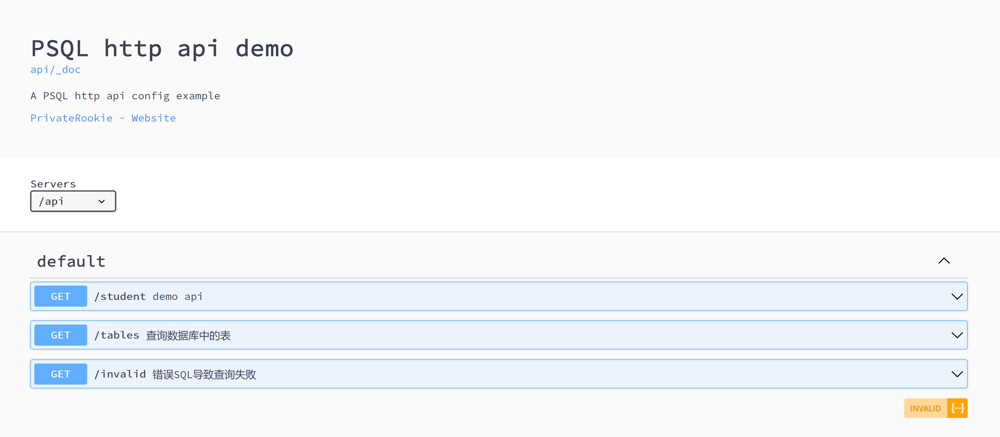

# psql
parameterized SQL parser

## syntax

`--?` stands for param definition, format

`--? <name>: <ty> [= <default>] [// <help message>]`

now PSQL support 3 basic ty `str`, `num`, `raw`,

`str` can be wrapped by double quote or single quote, `num` should be valid f64 in rust, and
`raw` stands for insert what ever you passwd, so, you can use it to insert build in function like `Date()`, `raw` is wrapped by "#".

Psql supports array type, format: `[<basic_type>]`

You can set a default value for parameter and help message, they are optional.

Use `@name` format to replace with parameter.

demo

```sql
--? age: num = 10 // useful help message
--? pattern: str // help
--? addrs: [str] = ['sh', 'beijing'] // address
--? pp: [num] // 必须使用???
select name from t where age=@age and name like @pattern and addr in @addrs and scores in @pp
```

to run cli example

```bash
cargo run --example cli --help
```

output

```bash
psql

Options:
    --age [AGE] num 10  useful help message
    --pattern *<PATTERN> str
                        help
    --addrs <ADDRS> [str] ('sh', 'beijing')
                        address
    --pp *<PP> [num]    pp
```

psql also support generate openapi doc and http api from a `plan.toml` config file. You can run `http` example with `-s` option to get `plan.toml` schema. A sample config is bellow

```toml
title = 'PSQL http api demo'
description = 'A PSQL http api config example'
# http 服务端口
address = ["0.0.0.0:12346", "0.0.0.0:8888"]

[contact]
name = "PrivateRookie"
url = "https://github.com/PrivateRookie"
mail = "996514515@qq.com"

# 定义数据库连接
[conns]
demo = "mysql://xxxxx/default"
info = "mysql://xxxxx/information_schema"

# 定义API, 数据库连接和SQL文件
[queries.demo]
conn = "demo"
summary = "demo api"
sql = "./sqls/demo.sql"
path = "student"

[queries.tables]
conn = "info"
summary = "查询数据库中的表"
sql = "./sqls/tables.sql"
path = "tables"

[queries.invalid]
conn = "info"
summary = "错误SQL导致查询失败"
sql = "./sqls/invalid.sql"
path = "invalid"

```

then run http example

```bash
cargo run --example http --features http -- -p plan.toml
```

visit `http://<target_host>:12345/index`, you will see generated doc explorer


